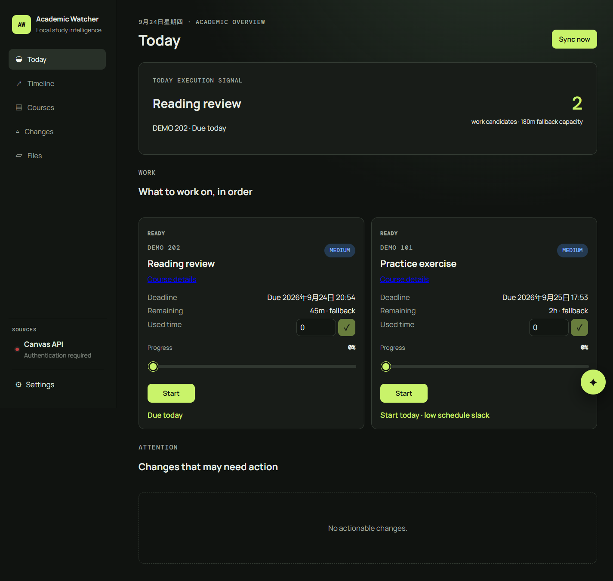
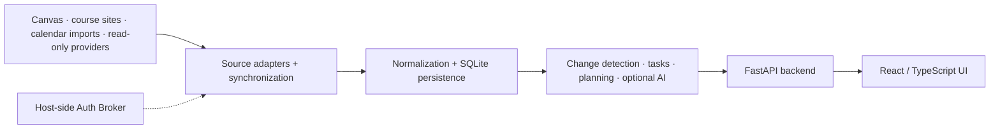

# CanvasWatcher / Academic Watcher

CanvasWatcher is a local-first, single-user academic monitoring and planning system. It brings Canvas and course-site materials, deadlines, tasks, and meaningful changes into one dashboard, with optional AI-assisted review. Records are stored locally; enabling AI features can send selected academic context to your configured model provider.

**Current public release:** v0.7.1 · [Deployment guide (English / 中文)](DEPLOYMENT.md) · [GNU GPL v2](LICENSE) · [Screenshots](#screenshots)

CanvasWatcher 是本地优先的单用户课程监测与学习规划工具：汇集 Canvas 和课程网站的资料、截止日期、任务与重要变更，可选用 AI 辅助审核。记录保存在本地；启用 AI 功能时，部分学业上下文可能发送至你配置的模型服务商。

*Today dashboard, captured from the real v0.7.1 UI with synthetic demo data. No personal course records or credentials are shown.*

## Architecture

**Stack:** FastAPI, SQLAlchemy, SQLite, Alembic · React, TypeScript, Vite · Docker Compose · pytest and Node frontend tests. The Auth Broker runs separately on the graphical host and hands browser sessions to source authentication after official sign-in.

## Highlights

- Synchronizes Canvas and course sites, with read-only Gradescope and PrairieLearn adapters. PrairieLearn enrolled-course parsing has **not** been validated against a real course.
- Normalizes course, task, file, and source records in SQLite; Alembic migrations preserve the evolving data model.
- Detects source changes and reconciles tasks/files; homepage change notices require explicit AI approval when optional AI review is enabled.
- Prioritizes today's work using deadlines, progress, available study time, and calendar context; imported ICS events are read-only.
- Offers optional AI Chat with read tools and an explicit confirmation boundary before write tools execute.
- Keeps browser-based sign-in in a separate local Auth Broker, with official provider pages handling passwords and MFA; automated backend/frontend tests and Docker Compose support repeatable deployment.

## Screenshots

- [Today dashboard — synthetic demo data](docs/screenshots/today-demo.png)
- [Timeline — the same synthetic demo data](docs/screenshots/timeline-demo.png)

These are screenshots of the running application with an isolated synthetic dataset, not mockups or images from a personal deployment.

## Deployment and security

This is a self-hosted, single-user project. The default Compose configuration binds the web UI, API, and optional ntfy service to loopback only. **Do not publish these ports directly to the internet.** See the [bilingual deployment guide](DEPLOYMENT.md) for setup, backups, and host-side Auth Broker instructions.

Browser sign-in uses official provider pages; passwords and MFA stay there. Enter API tokens and AI keys through the local UI rather than committing them. These credentials are process-memory-only unless explicitly configured otherwise, so a backend restart requires re-import. Google Calendar backend integration is read-only, but the direct connection UI is still marked as planned; do not assume it is ready for every deployment.

这是单用户自托管项目。默认 Compose 只绑定本机回环地址，**不要直接暴露到公网**。浏览器登录在官方页面完成密码和 MFA；Token 与 AI Key 应通过本地界面导入，不要提交到 Git。仅保存在进程内存中的凭据在后端重启后需要重新导入。安装、备份与 Broker 说明见[中英双语部署文档](DEPLOYMENT.md)。

## Development

This repository was made public at v0.7.1 after earlier private/local development; the visible public commits do not represent the full development timeline. Development was iterative, using AI coding agents under human-directed requirements, architecture decisions, testing, debugging, and acceptance review.

项目早期在本地／私有环境迭代，至 v0.7.1 才公开，因此公开提交历史并非完整开发时间线。开发中使用 AI 编码代理，并由人制定需求、作架构决策、测试、调试和验收。

## Source tree

- [`backend/`](backend/) — FastAPI, synchronization/AI services, database migrations, and tests.
- [`frontend/`](frontend/) — React/Vite UI and tests.
- [`auth-broker/`](auth-broker/) — separate host-side browser sign-in helper.
- [`config/*.example.yaml`](config/) — templates; real per-installation configuration is Git-ignored.

## License

Distributed under **GNU GPL version 2**; see [LICENSE](LICENSE). Keep this license and applicable copyright notices when redistributing or modifying the source. Third-party dependencies retain their own licenses. No credentials, browser profiles, databases, downloaded course files, or user-specific configuration are part of this repository.

本仓库按 **GNU GPL 第 2 版**发布，全文见 [LICENSE](LICENSE)。再分发或修改源码时请保留该许可及适用的版权声明；第三方依赖仍遵守各自许可。仓库不包含凭据、浏览器配置档、数据库、下载的课程文件或个人配置。
